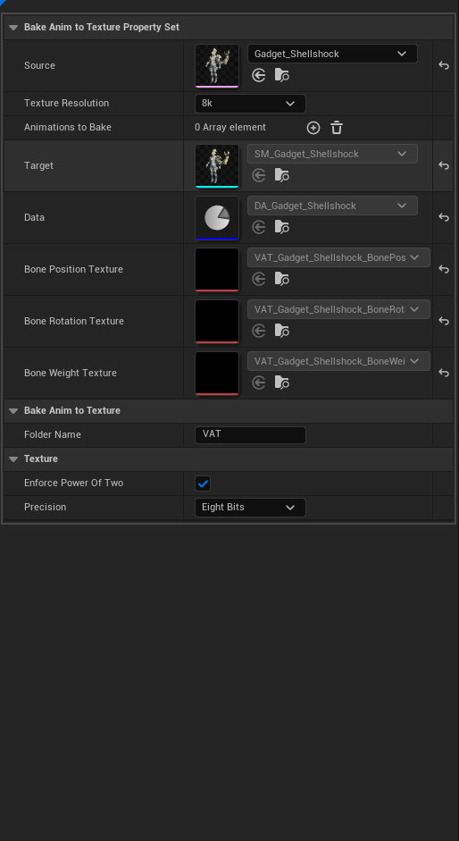
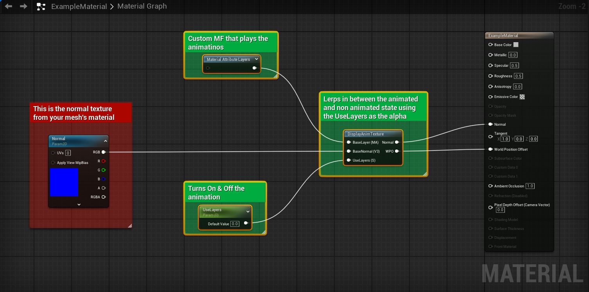

# OVERVIEW

One click tool that wraps the AnimToTexture plugin functionality and presents an integrated interface. This tool is heavily based on [this tutorial](https://www.youtube.com/watch?v=65nDfqEhKMQ)

# BEHAVIOR

- Auto creates a static mesh, data asset, and textures then stores them in the project files
- Auto generated assets are show to verify they've been created.
- Accepting the tool will bake the list of animations to the textures

## PARAMETERS

**SOURCE**

- Select any USkeletalMesh Asset you want to bake animations from.

**TEXTURE RESOLUTION**

- Enum value that translates to integer value for the texture's height and width. These are forced to be power of 2

**ANIMATIONS TO BAKE**

- The animations that you want the system to bake out. These should be put in some kind of order to make transitions smoother.

**FOLDER NAME**

- The sub folder name where the generated assets will be saved.

**ENFORCE POWER OF TWO**

- This will make sure the textures have a set size that is a power of 2. (Might be redundant since I've hard coded the sizes to be powers of two)

**PRECISION**

- How many bits per pixel. This will increase overall texture sizes but will offer a much cleaner looking end result.

# SETTING UP THE MATERIALS (ALPHA)
At this time you need to manually add the custom material functions to your mesh's base materials. 
There is an example material that has the nodes you need to copy into your base materials.
To view it you must enable plugin content then navigate to Handy Man Content → Tools → Core → AnimToTexture → Materials  

You only need to copy the nodes wrapped in green comments
1. Copy the material functions into your base material
2. Plug your normal texture into the base normal
3. Plug the output Normal & WPO into the correct pins
4. If you have existing WPO then use an **Add** node to add the results of your WPO to the output of the custom nodes.
5. Repeat for all base materials.

# HOW TO USE

1. Invoke the tool. You will get a prompt just letting you know that this tool requires a Skeletal Mesh as its input. You can disable this by adding the tools name to the blocked popup dialogs array located in Project Settings → Godtier Games → Handy Man → Blocked Popup Dialogs
2. Once you set your skeletal mesh the tool will generate all required assets for the animations to bake properly
3. Add the animations you want to bake to the array.
4. Once complete hit the accept button and the tool will bake those animations out to the generated textures as well as update the materials to work properly.
This is currently reliant on you setting the materials up correctly beforehand. In the future the materials will also be auto generated and set up automatically.

# LIMITATIONS

- At this time, the baked textures only affect LOD 0. 
This tool is also listed as **Alpha** because it requires WAY too much work outside the tool.
I need to make the process more streamlined. 
- There is currently no way to update baked assets other than restarting the process.
There are a few more parameters that will need to be added and most importantly I would prefer the tool to auto generate the materials.
This tool will still produce VAT properly, it's just a bit clunky right now.

# KNOWN ISSUES

- Making changes to the data set after the animations have been baked do not affect anything.
- At this time you are required to set your materials up. This is not the final vision of the tool and is on my TODO list to improve.
- Transitions do not work. The code is there and ready to use if hooked up. However, the way it was implemented is not ideal for my project so I didn't spend too much time on it.
- I have not added the fix for Nanite Meshes.