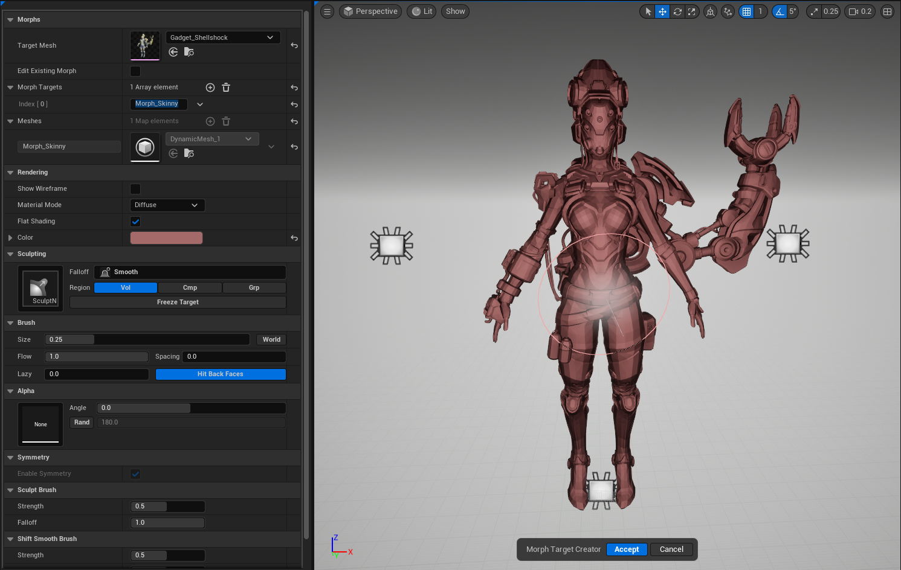



# OVERVIEW

Sculpt tool that allows the user to move verts around with some familiar brushes and save those changes off as a new morph target withing the target mesh.
The tool also allows users to edit existing morphs and either override them or save those changes off as a new morph. Future versions of the tool will allow you
to save a morph target off as a custom skeletal mesh.

# BEHAVIOR

- Use familiar brushes to add details or change volumes on a skeletal mesh.
- Edit existing morphs and override them or use them as a base for a whole new morph.
- Undo/Redo functionality.

## PARAMETERS

**TARGET MESH**

- Select any USkeletalMesh Asset you want to cut up.

**EDIT EXISTING MORPHS**

- This will display a hidden option that will list all the available morphs on the target mesh. Selecting one will reflect in the mesh and it will automatically add
an entry to the morph target map with the name of that morph.

**MORPH TARGETS**

- An array of FName that are used to trigger the tool create a new dynamic mesh also resetting the displayed base mesh.

## HOW TO USE

1. Invoke the tool. You will get a prompt just letting you know that this tool requires a Skeletal Mesh as its input. You can disable this by adding the tools name to the blocked popup dialogs array located in Project Settings → Godtier Games → Handy Man → Blocked Popup Dialogs
2. Once you set your skeletal mesh the tool will spawn the display actor with the premade cutter volumes
3. Move, Scale & Rotate each cutter to encapsulate the geometry you want to cut
4. Once complete hit the accept button and the tool will create an asset in you project files next to the input skeletal mesh using the folder name you provide.

# LIMITATIONS

At this time, the cut only affects the first LOD. I have it on my TODO list to support the final operation cutting each LOD using the provided cutter volumes.

# KNOWN ISSUES

- Undo past the initial undo buffer will actually undo opening the tool. Just be care how fast you are hitting Ctrl+Z and you should be fine
- Removing cutters from the array has not been tested fully. If you feel a cutter is not working how you envisioned then move it out of the bounds of the character mesh.