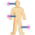
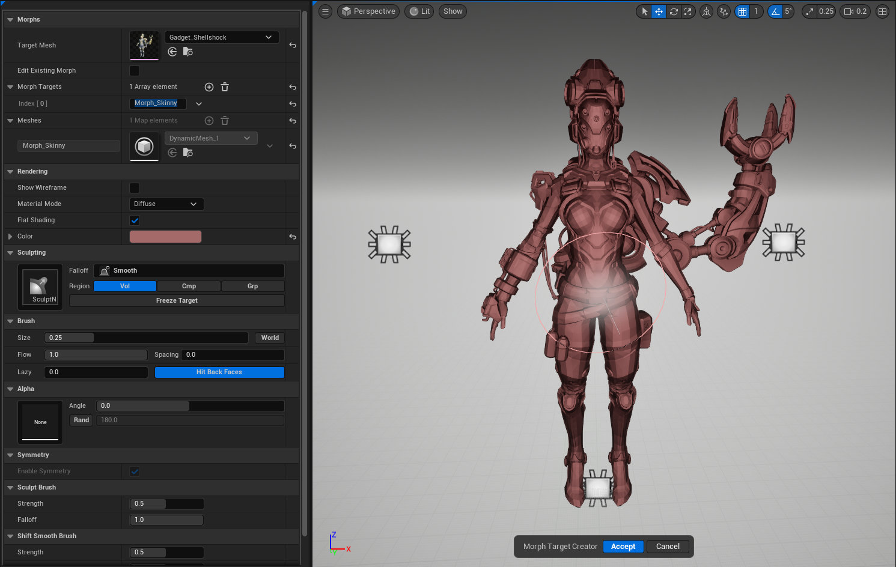
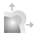
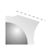
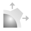



# OVERVIEW

Sculpt tool that allows the user to move verts around with some familiar brushes and save those changes off as a new morph target withing the target mesh.
The tool also allows users to edit existing morphs and either override them or save those changes off as a new morph. Future versions of the tool will allow you
to save a morph target off as a custom skeletal mesh. 

### NOTE
This tool does not change the vert count on the input mesh. To put it simply you are only able to manipulate the existing geometry. 
However, it is very flexible.

# BEHAVIOR

- Use familiar brushes to add details or change volumes on a skeletal mesh.
- Edit existing morphs and override them or use them as a base for a whole new morph.
- Undo/Redo sculpt functionality.

## PARAMETERS

**TARGET MESH**

- Select any USkeletalMesh Asset you want to cut up.

**EDIT EXISTING MORPHS**

- This will display a hidden option that will list all the available morphs on the target mesh. Selecting one will reflect in the mesh and it will automatically add
an entry to the morph target map with the name of that morph.

**MORPH TARGETS**

- An array of FName that are used to trigger the tool create a new dynamic mesh also resetting the displayed base mesh.

**SHOW WIREFRAME**

- Toggle the display of the wireframe.

**MATERIAL MODE**

- Enum value that changes the display material.

**FLAT SHADING**

- Toggles the display of smooth or hard edges for the sculpt mesh.

**COLOR**

- Changes the color of the mesh while in Diffuse material mode.

## BRUSHES

There are per brush settings for 
- SIZE
- FLOW
- SPACING
- LAZY MOUSE
- HIT BACK FACES

Shift activates the smoothing brush while Ctrl inverts the selected brushes' functionality.
For certain brushes you can apply a Texture map and use it to affect the overall stamp and shape of the brush.

 **FLATTEN**
- Move vertices towards the average plane of the brush stamp region

 **GRAB**
- Grab Brush, fall-off alters the influence of the grab.

 **GRAB SHARP**
- Grab Brush that may generate cusps, fall-off alters the influence of the grab.

 **INFLATE**
- Displace vertices along their vertex normals

 **MOVE**
- Similar to the move brush in most sculpting programs with a flat falloff.

 **PINCH**
- Move vertices towards the center of the brush (Ctrl to push away)

 **PLANAR (NORMAL)**
- Move vertices towards a plane defined by the initial brush position.

 **PLANAR (VIEWPOINT)**
- Move vertices towards a view-facing plane defined at the initial brush position.

 **PLANAR (FIXED PLANE)**
- Move vertices towards a fixed plane in world space, positioned with a 3D gizmo.

 **SCALE**
- Scale Brush will inflate or pinch radially from the center of the brush

 **SCULPT (MAX)**
- Displaces vertices along the average surface normal to a maximum height based on the brush size (Ctrl to invert)

 **SCULPT (NORMAL)**
- Displace vertices along the average surface normal (Ctrl to invert)

 **SCULPT (VIEWPOINT)**
- Displace vertices towards the camera viewpoint (Ctrl to invert)

 **SMOOTH**
- Smooth mesh vertices

 **SMOOTH FILL**
- Smooth mesh vertices but only in direction of normal (Ctrl to invert)

 **TWIST**
- Twist Brush moves vertices in the plane perpendicular to the local mesh normal

## HOW TO USE

1. Invoke the tool. You will get a prompt just letting you know that this tool requires a Skeletal Mesh as its input. You can disable this by adding the tools name to the blocked popup dialogs array located in Project Settings → Godtier Games → Handy Man → Blocked Popup Dialogs
2. Once you set your skeletal mesh the tool will spawn the sculpt actor and display the base mesh.
3. Choose to either edit an exiting morph. Or create a new one by adding an entry to the Morph Target array.
4. Use the different sculpting brushes to get the look you want.
5. Once complete hit the accept button and the tool will store each morph created into the input mesh.

# LIMITATIONS

- At this time, the morph only affects the first LOD. 
I'm not 100% sure the tool will ever be able to apply the morph to other LODs.
- There is no concept of custom brushes
- You cannot combine functionality. For example you cannot sculpt on an existing morph then add a custom morph. Those two features erase the work done by the other.

# KNOWN ISSUES

