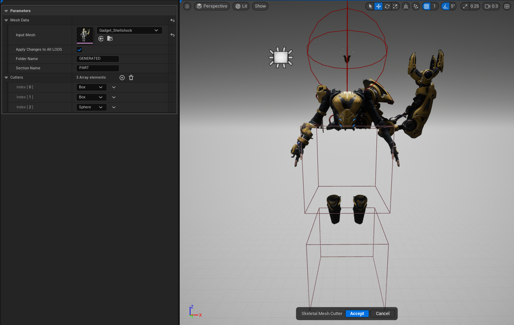



# OVERVIEW

Interactive tool that allows the user to add cutter volumes, shape them and each triangle within those volumes will be deleted. This is a helpful tool to cull unnecessary geometry for something like an invisible skeleton or just chopping up a mesh to get only the arms for a first person view model.

# BEHAVIOR

- Single click tool that spawns a representation proxy into the world with a few pre-placed cutter volumes
- User will input a mesh and then geometry script will procedurally copy the highest LOD into a dynamic mesh
- Users can click on and interact with the cutter volumes using a TRS Gizmo
- Each cutter’s gizmo respects Undo & Redo behavior.
- Accepting the tool will create a new skeletal mesh asset.

## PARAMETERS

**INPUT MESH**

- Select any USkeletalMesh Asset you want to cut up.

**APPLY CHANGES TO ALL LODS**

- Will force the tool to copy the final geo into every LOD of the mesh. If false it will only be copied into LOD 0

**FOLDER NAME**

- The sub folder name where the generated assets will be saved.

**SECTION NAME**

- The sub name of the mesh this will be part of the final object name (SKM_Manny_SECTIONNAME)

**CUTTERS**

- An array of Enums designating which shape to use. Currently there are only 2 shapes Sphere & Box.

## HOW TO USE

1. Invoke the tool. You will get a prompt just letting you know that this tool requires a Skeletal Mesh as its input. You can disable this by adding the tools name to the blocked popup dialogs array located in Project Settings → Godtier Games → Handy Man → Blocked Popup Dialogs
2. Once you set your skeletal mesh the tool will spawn the display actor with the premade cutter volumes
3. Move, Scale & Rotate each cutter to encapsulate the geometry you want to cut
4. Once complete hit the accept button and the tool will create an asset in you project files next to the input skeletal mesh using the folder name you provide.

# LIMITATIONS

At this time, the cut only affects the first LOD. I have it on my TODO list to support the final operation cutting each LOD using the provided cutter volumes.

# KNOWN ISSUES

- Undo past the initial undo buffer will actually undo opening the tool. Just be care how fast you are hitting Ctrl+Z and you should be fine
- Removing cutters from the array has not been tested fully. If you feel a cutter is not working how you envisioned then move it out of the bounds of the character mesh.