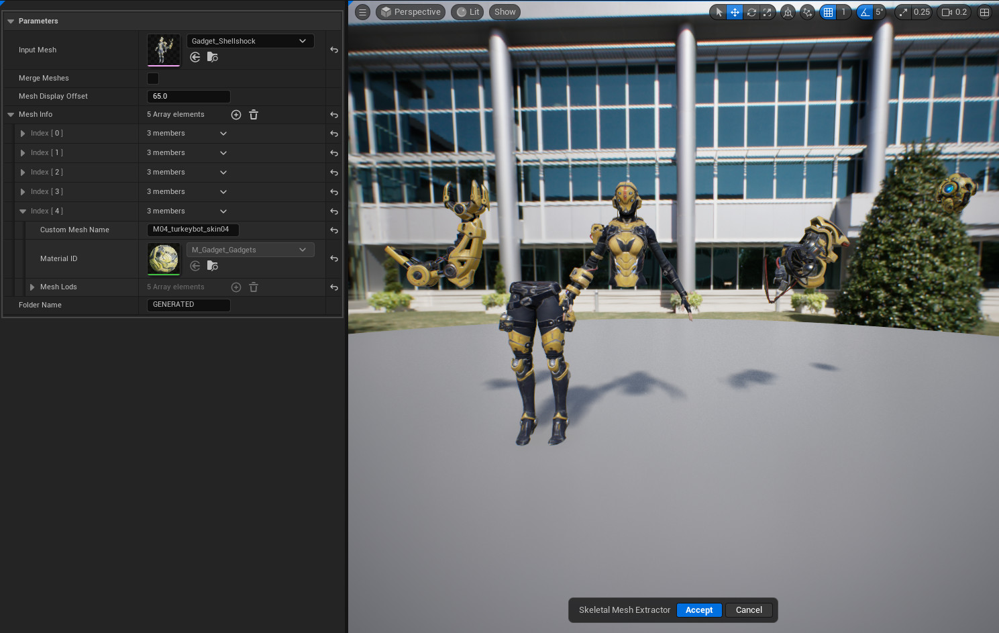



# OVERVIEW

One click solution to take a mesh that has multiple material IDs and make it modular by splitting each different material ID into a separate skeletal mesh. This tool also handles merging meshes together. This tool is helpful for extracting meshes bound to a skeletal mesh and making them separate assets or merging a few parts of a mesh together for something like a first person rig.

# BEHAVIOR

- Single click tool that spawns a representation proxy into the world to show you your split parts joined and blown out using a float parameter.
- User will set a mesh and then geometry script will procedurally copy the geometry for each material id into a collection holding each LOD as an array element. This will be stored in a structure that will store the array of LODS as well as a pointer to the material.
- Users will have the option to input a custom name for each slot id.
- Once the command is accepted, geometry script will iterate over each mesh info structure with a nested loop for each LOD and copy that into a new asset based on the input asset this is a long operation

## PARAMETERS

**INPUT MESH**

- Select any USkeletalMesh Asset you want to split up.

**MERGE MESHES**

- Will trigger the tool to merge all of the meshes in the Mesh Info array.

**MESH DISPLAY OFFSET**

- Will offset each mesh by this value on the world X axis.

**FOLDER NAME**

- The sub folder name where the generated assets will be saved.

**MESH INFO**

- Auto generated. Holds a reference to the material ID, the generated UDynamicMesh and has an option to change the name of the slot which will be used when saving out the extracted asset. It has a fixed max size based on the number of materials.

## HOW TO USE

1. Invoke the tool. You will get a prompt just letting you know that this tool requires a Skeletal Mesh as its input. You can disable this by adding the tools name to the blocked popup dialogs array located in Project Settings → Godtier Games → Handy Man → Blocked Popup Dialogs
2. Once you set your skeletal mesh the tool will automatically split it up by material IDs. This may take some time depending on how many unique material IDs you have
3. From this point you can choose to remove any array element you choose.
4. Once complete hit the accept button and the tool will create an asset for each element in the array. 
The tool handles material remapping so that the final asset will only have the necessary material IDs present. 
It also copies each LOD over so you don’t have to worry about regenerating LODs. This can be a time-consuming process.

# LIMITATIONS

At this time, manually adding elements to the Mesh Info array is not expected behavior and will cause the tool to crash during the cook process. You are free to remove any mesh in the array. Support for Undo/Redo is still pending so if you happen to remove the wrong mesh, Cancel the tool and start over.
