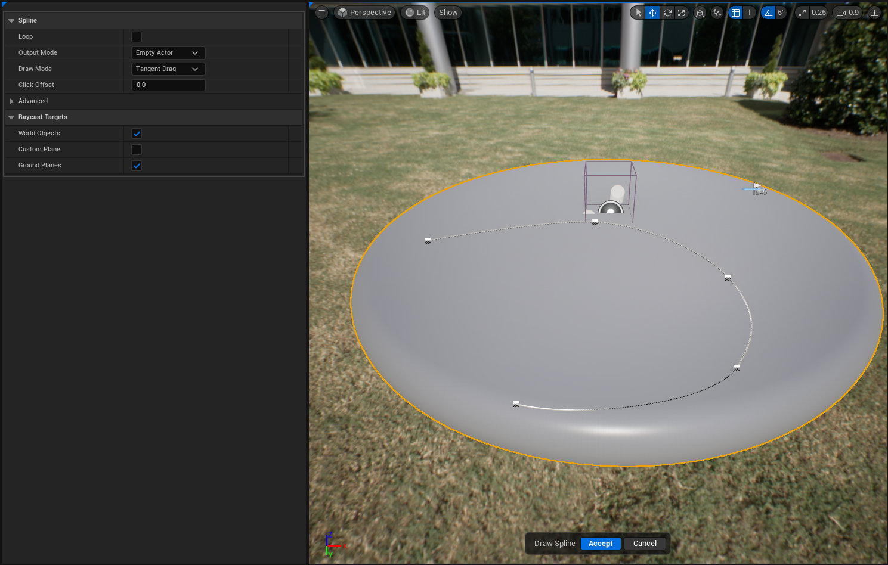

 
# DRAW SPLINE

# OVERVIEW

Interactive tool that allows the user to draw a spline into the world that can be used with other tools.
This is a carbon copy of the Draw Spline tool in the Modeling Mode, just thought it would be convenient to have one built in.

# BEHAVIOR

- Draw a spline into the world using 3 different modes (Tangent Drag, Auto-Tangent, Free Draw)
- Store spline in an empty actor, existing actor or generate a new blueprint.

## PARAMETERS

### LOOP

- Determines whether the created spline is a loop. This can be toggled using "Closed Loop" in
the detail panel after spline creation.

### OUTPUT MODE
 
**Empty Actor**
- Create a new empty actor with the spline inside it

**Existing Actor**
- Attach the spline to an existing actor, or replace a spline inside that
actor if Existing Spline Index To Replace is valid.

**Create Blueprint**
- Create the blueprint specified by Blueprint To Create, and either attach
the spline to that, or replace an existing spline if Existing Spline Index
To Replace is valid.

### DRAW MODE

**Tangent Drag**
* Click to place a point and then drag to set its tangent. Clicking without dragging will create sharp corners.

**Click Auto Tangent**
* Click and drag new points, with the tangent set automatically

**Free Draw**
* Drag to place multiple points, with spacing controlled by Min Point Spacing

### CLICK OFFSET

- How far to offset spline points from the clicked surface, along the surface normal

### UP VECTOR MODE

**Align To Previous**

* Pick the first up vector based on the hit normal, and then align subsequent up vectors with the previous ones.

**Use Hit Normal**

* Base the up vector off the hit normal.

### WORLD OBJECTS

- Whether to place spline points on the surface of objects in the world

### CUSTOM PLANE

- Whether to place spline points on a custom, user-adjustable plane

### GROUND PLANES

- Whether to place spline points on a plane through the origin aligned with the Z axis in perspective views, or facing the camera in othographic views

## HOW TO USE

1. Invoke the tool. 
2. Choose the preferred draw mode
3. Click & Drag to place points on valid raycast targets
4. Once complete hit the accept button and the tool will an empty spline actor into the world that can be used in other spline based tools.

# FUTURE FEATURES
1. After the spline is drawn the user is presented with an actions window that will run the requested command

# LIMITATIONS

# KNOWN ISSUES

- At this time undo/redo functionality is not working as expected. The transaction is sent and you can see the message push to the screen however the spline points remain the same.

