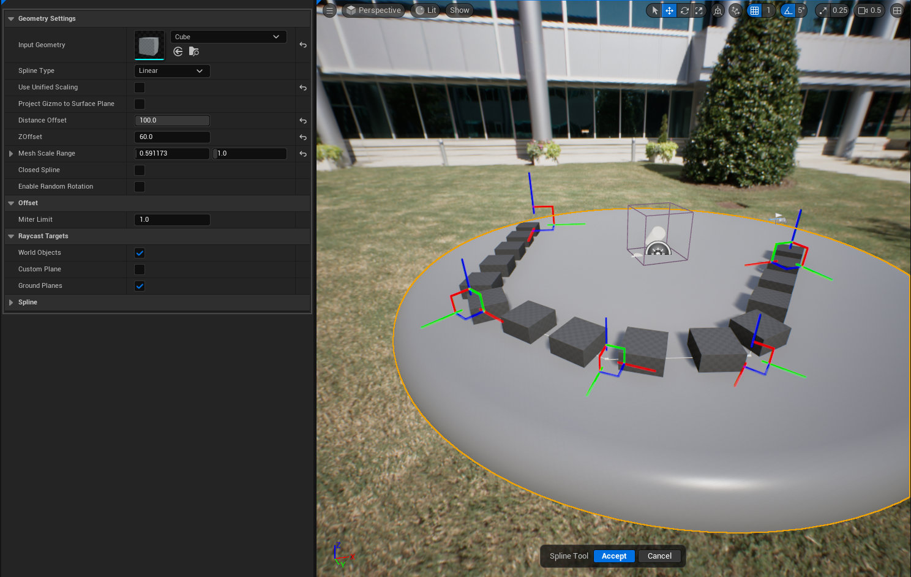



# FENCE

# OVERVIEW

Interactive tool that allows the user to place spline points in the world and PCG will procedurally place the input mesh along the spline 
using the distance offset. This tool is similar to the rail tool except it does not generate any collision geometry and it does not tag the 
actor or component for gameplay interactions. The input mesh placement along the spline is highly dependent on the pivot of the mesh.

# BEHAVIOR

- Spawns a PCG actor that is updating and as the spline grows.
- Each point has an interactable gizmo making post point edits easier.

## PARAMETERS

### INPUT GEOMETRY

- The geometry that PCG will procedurally place along the spline.

### SPLINE TYPE

- Changes the curvature of the spline based on the selection.

### USE UNIFIED SCALING

- When true the scale of the input geometry will be uniform. Setting this to false will display another option to change the
  scale range of the mesh. This will add randomized scaling along the curve. That variable is called **Mesh Scale Range**

### PROJECT GIZMO TO SURFACE PLANE

- Snaps the gizmos transform to an underlying surface when being moved.

### DISTANCE OFFSET

- The distance between the input geometry placed along the spline

### Z OFFSET

- This is a legacy setting from the base tool property set. It will be hidden in a future version.

### AUTO GENERATE COLLISION GEOMETRY

- This is a legacy setting from the base tool property set. It will be hidden in a future version. It's supposed to be false by default in
  the fence tool

### CLOSED SPLINE

- Sets the spline to a closed loop.

### ENABLE RANDOM ROTATION

- Applies random rotation to each mesh spawned by PCG based on the values given from the user.

### WORLD OBJECTS

- Whether to place spline points on the surface of objects in the world

### CUSTOM PLANE

- Whether to place spline points on a custom, user-adjustable plane

### GROUND PLANES

- Whether to place spline points on a plane through the origin aligned with the Z axis in perspective views, or facing the camera in othographic views

# FUTURE FEATURES
1. Improve UX. There are a few variables present that the user shouldn't interact with that can potentially make the tool crash or run incorrectly.

# LIMITATIONS

# KNOWN ISSUES
- Project Points To Surface toggle sometimes crashes the engine.
- Incorrect pivots for the Input Mesh can cause the Look At functionality implemented in PCG to look wrong.
The pivot must be on one of the furthest corners and set to the bottom for the most accurate rotations.

