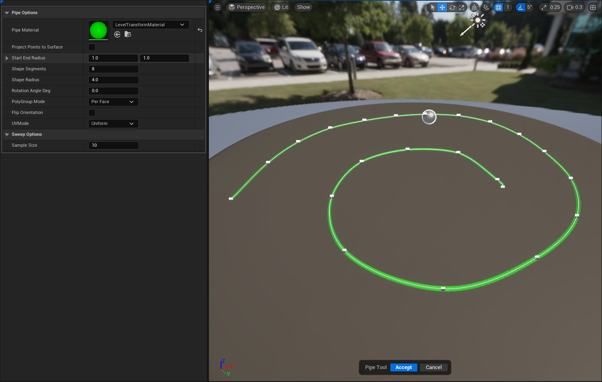



# PIPE

# OVERVIEW

Single click tool that allows the user to sweep circular geometry along an existing spline. This tool cannot be invoked unless an actor is selected
and that actor has a spline component.

# BEHAVIOR

- Spawns a dynamic mesh actor for each spline component in the input actor.
- Once accepted each actor is still live and can be altered using the details panel.

## PARAMETERS

### PIPE MATERIAL

- The display material to show on the pipe. This can be changed after the pipe has been generated.

### PROJECT POINTS ON SURFACE

- Takes each point from the spline and projects its transform onto an underlying surface.

### START & END RADIUS

- Gradually alters the scale of the pipe's tip and base.

### SHAPE SEGMENTS

- Adds more resolution to the circle shape that is swept along the spline. This will increase the number of triangles 
potentially causing the tool to run slower. 

### SHAPE RADIUS

- Overall thickness of the pipe.

### ROTATION ANGLE DEG

- Rotates the pipe along the forward axis of the spline.

### POLYGROUP MODE

- Determines how poly groups are made. This is here since all dynamic meshes can be edited within the Modeling Tools.

### FLIP ORIENTATION

- This is a legacy setting for other swept geometry shapes, it does not apply to the circular sweep and has been removed.

### UV MODE

- Determines how the mesh will be unwrapped.

### SAMPLE SIZE

- This is the divisor against the splines length which will determine how smooth the pipe follows the splines shape. 
Higher numbers equal less geometry since it will make the final sample size smaller.[

# FUTURE FEATURES
1. Add options to apply randomness. Which will only be applicable to input actors with multiple spline components.
2. Add more sweeping shapes (Box, Rectangle, Custom)
3. Add options for custom geometry to be accepted. This will require that the geo is pre-made to work with the tool.
For example, you would have to author a mesh that fit your desired sample size and was orientated to the right axis.
4. Procedurally Generate Caps/Connectors with options to set the desired distance between each one.

# LIMITATIONS

# KNOWN ISSUES

- At this time undo/redo functionality is not working as expected. 
Undo will actually undo the tool starting up and not any changes made in the tool.
- Project Points To Surface toggle doesn't function. Points remain at their current world transform

