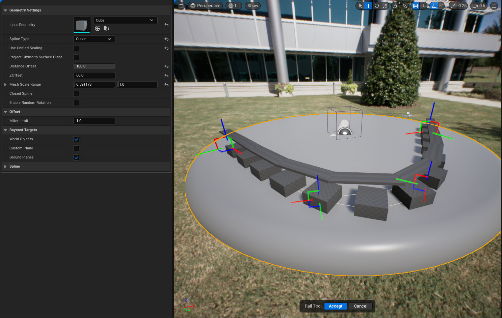



# RAIL

# OVERVIEW

Interactive tool that allows the user to place spline points in the world and collision geometry will be automatically generated so that the top
of the spline can be interacted with. This tool is kind of niche to my project needs but is a good example on how to build a tool that makes
Level editing with custom actors a bit less clunky. This tool was only built for easily adding rails to my game that the player could grind on
similar to [this game mechanic](https://www.youtube.com/watch?v=ANTvUksV7HU)

# BEHAVIOR

- Spawns a dynamic mesh actor that is updating and as the spline grows.
- Creates a dynamic collider and places it on top of the input geometry. The actor and the component is also tagged with *Rail* 
so that gameplay mechanics can recognize it.
- Collider is set to be hidden during gameplay and only interacts with pawns.
- Each point has an interactable gizmo making post point edits easier.

## PARAMETERS

### INPUT GEOMETRY

- The geometry that PCG will procedurally place along the spline.

### SPLINE TYPE

- Changes the curvature of the spline based on the selection.

### USE UNIFIED SCALING

- When true the length and width of the generated collider will be uniform. Setting this to false will display another option to change the
scale multiplier on the X & Y axis. That variable is called **Mesh Scale Range**

### PROJECT GIZMO TO SURFACE PLANE

- Snaps the gizmos transform to an underlying surface when being moved.

### DISTANCE OFFSET

- The distance between the input geometry placed along the spline

### Z OFFSET

- The vertical offset applied to the overall location of the dynamic collider.

### AUTO GENERATE COLLISION GEOMETRY

- This is a legacy setting from the base tool property set. It will be hidden in a future version. It's supposed to be true by default in
the rail tool

### CLOSED SPLINE

- Sets the spline to a closed loop.

### ENABLE RANDOM ROTATION

- This is a legacy setting from the base tool property set. It will be hidden in a future version.

### WORLD OBJECTS

- Whether to place spline points on the surface of objects in the world

### CUSTOM PLANE

- Whether to place spline points on a custom, user-adjustable plane

### GROUND PLANES

- Whether to place spline points on a plane through the origin aligned with the Z axis in perspective views, or facing the camera in othographic views

# FUTURE FEATURES
1. Fix closed loops. This can be done by adding a point slightly infront of the last point and the setting that points location to the first point.
2. Fix the dynamic geometry, currently its crude and has no options to improve its curvature. At first this was to make sure the collider 
had a low poly count but in some cases it messes up the accuracy of the collision

# LIMITATIONS

# KNOWN ISSUES
- Project Points To Surface toggle sometimes crashes the engine.
- Closed Loop has an issue with the dynamically created geo, meaning circular rails need special care.

