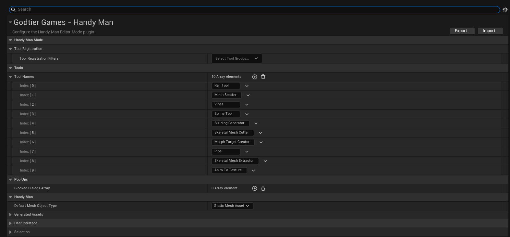

# INTRODUCTION

Handy Man is a suite of tools meant to speed up different parts of development. 
The current focus of the tools were built around my project needs but the tools ended up having generic enough foundations to share. 
These tools are still in their early stages and will need improvements as I battle test them.
The foundation is built on the [Scriptable Tools Framework](https://dev.epicgames.com/documentation/en-us/unreal-engine/scriptable-tools-system-in-unreal-engine) 
but is a separate editor mode so that they don't conflict.
With the repo there are 2 plugins. One is the Handy Man editor mode and the other is Handy Man Geometry Script Utils.
This is a small library of helper functions that combine 2 or more different function calls into one.

# INSTALLATION
1. Firstly this plugin requires a C++ project learn how to convert a BP project to a C++ project [here](https://www.youtube.com/watch?v=3iTU_4IBrqM)
2. Create a **Plugins** folder in your projects root folder then drag & drop the extracted **Handy Man Plugin** folder inside it.
3. Delete both **Binaries** & **Intermediate** folders and the **.SLN** file from your projects' directory.
4. Right-click the **.UPROJECT** file and select **Generate Visual Studio Project Files**
5. Open the .SLN file in the IDE of your choice (preferably Rider).
6. An optional step you can take here is to set your IDE configuration to Debug Game Editor. This will give you the opportunity to add break point to the code to see how it runs.
7. Build and run the project

# POP UP DIALOGS
Most tools have a dialog box that pops up before the tool startup phase. These usually have information about input parameters and requirements.
Once you feel like you have that tool's workflow down you can disable it by adding it to the Blocked Popup Dialogs Array in the project settings.
This is found in Project Settings → Godtier Games → Handy Man → Blocked Popup Dialogs.

# TABLE OF CONTENTS

- [Tool Set](doc/ToolSet.md)
- [Known Issues](doc/KnownIssues.md)
- [Limitations](doc/Limitations.md)
- [Adding Custom Tools](doc/CustomTools.md)

# SUPPORT THE PROJECT
The best way to support this project is PRs with cool tools and improvements so that the community can take advantage.
With a ton of high costing marketplace assets and now even SUBSCRIPTION based marketplace assets we have to come together and build our own.
If you want to support me directly there are a few ways to do so.
- **Star This Project**

